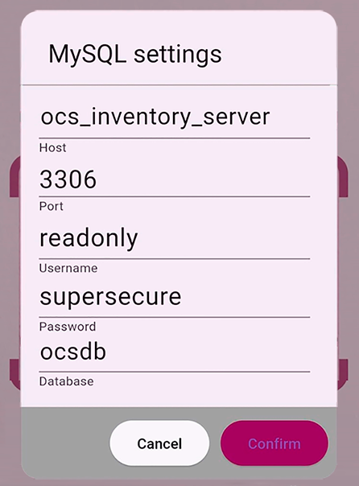
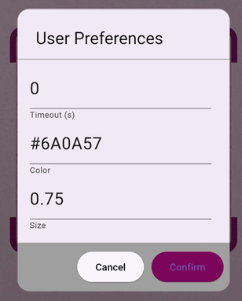
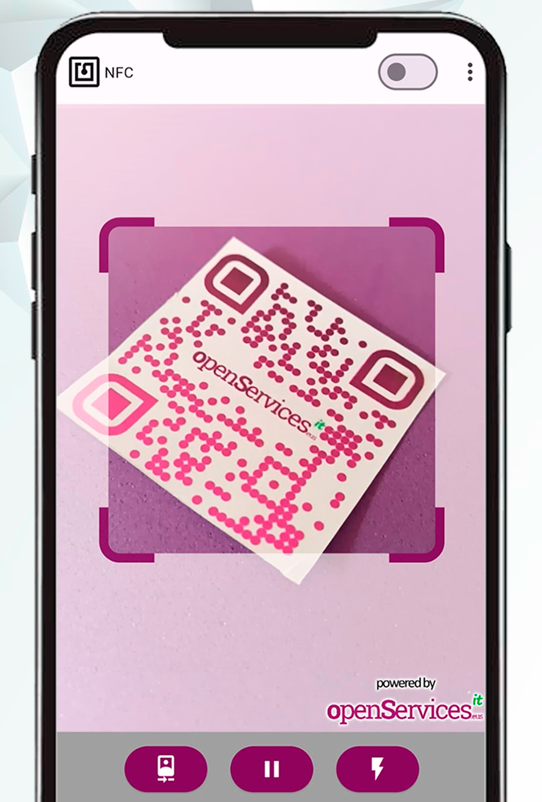
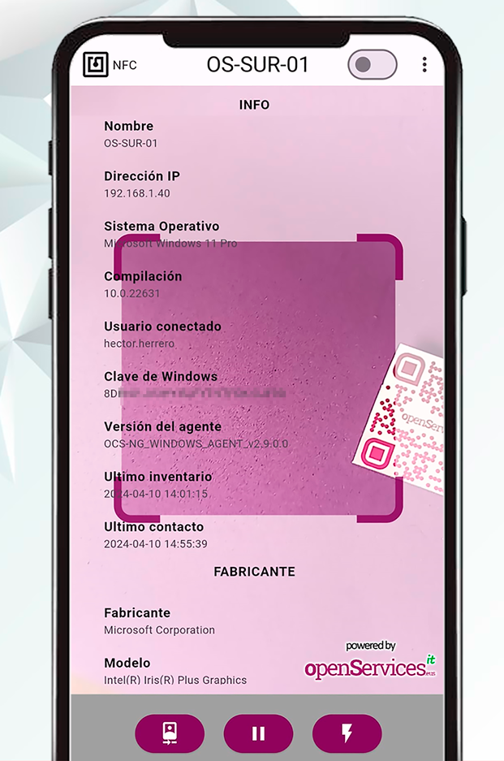
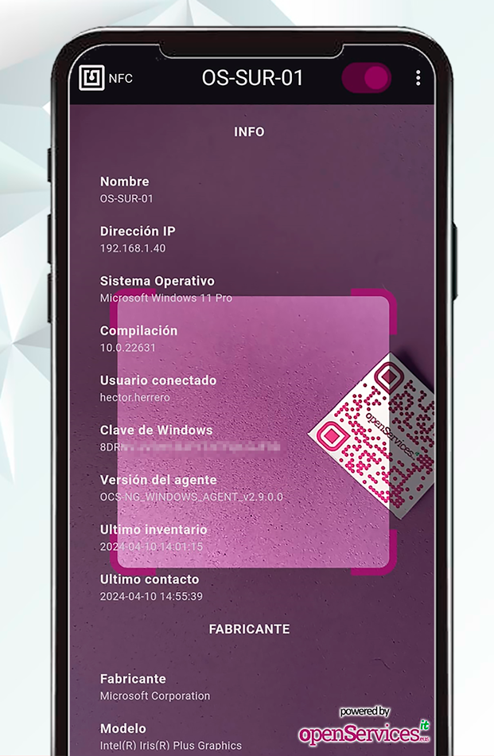
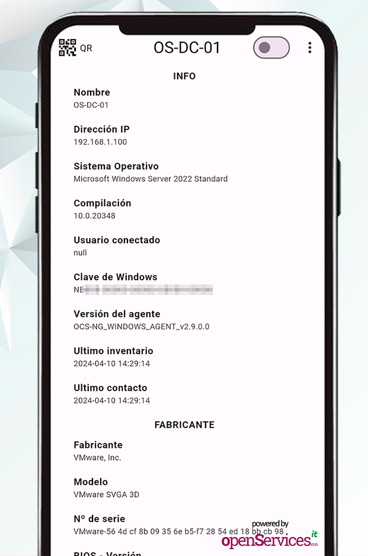
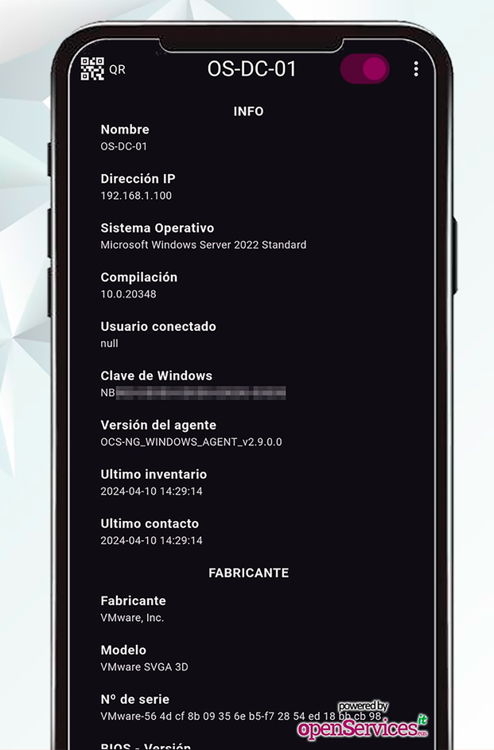

# OSit Inventory

OSit Inventory es una app gratuita que funciona en Android e iOS y permite escanear códigos QR y etiquetas NFC que tengamos pegados en los elementos core de nuestra organización, sea en equipos de sobremesa, portátiles, servidores, cabinas de almacenamiento... con el objetivo de visualizar en tiempo real sus datos de inventario hardware o software.

OSit Inventory obtiene la información del sistema de inventario OCS Inventory NG, por tanto, si dispones de tu infraestructura inventariada (y eres feliz) podrás bajarte la app y usarla de manera gratuita en tus móviles o tablets. Es una app de código abierto, no tiene publicidad y viene sin soporte.

OSit Inventory tiene una hermana gemela llamada OSit , en su caso muestra datos de monitorización en tiempo real, más info: https://github.com/Open-Services-IT/OSit-Monitor

## Cómo funciona

Es muy simple, al abrir la app directamente mostrará la cámara de tu teléfono móvil o de tu tablet, con Android o iOS, con ella escanearemos un código QR que tengamos pegado en un dispositivo inventariado con OCS Inventory. En el momento de leer el código QR mostrará en pantalla un inventario completo con todo el hardware y el software del equipo escaneado. Y si preferimos escanear una etiqueta NFC, bastará con pulsar el icono del NFC en la app y se quitará la cámara y quedará listo para acercar nuestro dispositivo móvil a la etiqueta NFC y ver los datos en pantalla.

## Qué necesitamos

Podremos usar cualquier generador de códigos QR para las pegatinas, como puedan ser webs que ofrecen dicho servicio gratuito. Al generar los códigos QR, tendremos que tener en cuenta que cada código QR devolverá una palabra únicamente, siendo esta, el nombre de su equipo en OCS Inventory.

Las etiquetas NFC igualmente deberán llevar una cadena de texto con el nombre del equipo en OCS Inventory. Podremos comprar pequeñas etiquetas escribibles NFC por pocos céntimos en Internet, y escribirlas con cualquier app que encontremos en los Stores de Apple o Android.

Si usamos una impresora de pegatinas, podremos imprimir y pegar el QR sobre la etiqueta NFC para tenerlo todo junto.

La versión inicial de OSit Inventory sólo permite conectar a OCS Inventory mediante una conexión MariaDB/MySQL, por tanto, será necesario crear un usuario de lectura en la BD de OCS Inventory y tener conectividad a ella.

## Qué podemos ver

Como indicamos, al escanear un código QR o una etiqueta NFC se mostrará en pantalla todo el hardware y software de dicha máquina. Gracias a OCS Inventory NG sabemos que podemos tener un inventario actualizado de cualquier componente hardware o software instalado en nuestras máquinas, pues ahora, lo podemos ver en tiempo real y desde cualquier sitio, delante de un equipo, de un servidor y conocer cualquier detalle que necesitemos de su hardware, como pueda ser qué discos tiene, su capacidad, su número de serie, o cuántos módulos de memoria RAM tiene ocupados, o si tiene un software instalado y qué versión.

- Información genérica:
  - Nombre del equipo.
  - Dirección IP.
  - Sistema Operativo.
  - Compilación del S.O.
  - Usuario conectado.
  - Clave de Windows.
  - Versión del agente de inventario.
  - Fecha del último inventario.
  - Fecha del último contacto.
- Fabricante:
  - Nombre del fabricante.
  - Modelo.
  - Nº de serie.
  - Versión de la BIOS.
  - Fecha de la BIOS.
- Procesador:
  - Procesador.
  - Nº de procesadores.
  - Nº de cores.
- Memoria:
  - Memoria total.
  - Slots ocupados.
  - Slots libres.
  - Almacenamiento:
- Disco:
  - Capacidad.
  - Versión del firmware.
- Unidades:
  - Letra de unidad.
  - Sistema de archivos.
  - Espacio libre.
  - Espacio ocupado.
- Controladoras:
  - Controladora.
  - Fabricante.
  - Tipo de controladora.
- Adaptadores de red:
  - Nombre del adaptador.
  - Dirección MAC.
  - Dirección IP.
  - Máscada de red.
  - Puerta de enlace.
  - Servidor DHCP.
- Tarjetas gráficas:
  - Modelo.
  - Memoria.
  - Resolución.
- Tarjetas de sonido:
  - Modelo.
  - Número de serie.
  - Tipo.
  - Descripción.
- Impresoras:
  - Nombre de impresora.
  - Driver.
  - Puerto.
  - Compartida.
  - Impresora de red.
- Software instalado:
  - Nombre del software.
  - Fabricante del software.
  - Versión del software.

## Wiki

### Requisitos en OCS Inventory NG

Como hemos comentado, la versión actual de OSit Inventory conecta directamente al motor de base de datos de OCS Inventory, a una base de datos MySQL o MariaDB, por tanto, será necesario crear un usuario específico en la BD de OCS Inventory, con permisos de lectura únicamente. Lo podremos hacer desde la shell del servidor de BBDD, conectando con el comando 'mysql' y las siguientes 2 instrucciones, deberemos indicar un usuario y una contraseña de nuestro interés.

    CREATE USER 'readonly'@'%' IDENTIFIED BY 'CONTRASEÑA';
    GRANT SELECT ON ocsweb.* TO 'readonly'@'%';

**Nota**: El segundo comando permite que se pueda acceder desde cualquier dirección IP. Si queremos especificar las direcciones IP desde donde se van a conectar los dispositivos móviles, se podría indicar, bien sea un rango IP o unas cuantas direcciones IP manuales, lo haríamos sustituyendo el % por cada IP, ejemplo:

    GRANT SELECT ON ocsweb.* TO 'readonly'@'192.168.1.33';
    GRANT SELECT ON ocsweb.* TO 'readonly'@'192.168.1.34';
    GRANT SELECT ON ocsweb.* TO 'readonly'@'192.168.1.%';

**Nota 2**: Desconocemos el versionado de OCS Inventory necesario, está validado con la última al escribir estas notas, 2.12.0, entendemos que será compatible con versiones anteriores y futuras.

**Nota 3**: Si la primera vez, la aplicación al leer los datos nos da el error '*MySQLClientException: Auth plugin caching_sha2_password is unssupported oly with secure connections. Pass secure: true or use another auth method*' deberemos ejecutar este comando adicionalmente a los anteriores que crearon el usuario, teniendo en cuenta sustituir el % como lo hiciste antes:

    ALTER USER 'readonly'@'%' IDENTIFIED WITH mysql_native_password BY 'CONTRASEÑA';

### Configurar la app

Una vez dispongamos de la app instalada en nuestro teléfono móvil o tablet Android o iOS, podremos configurar la conexión a MySQL/MariaDB desde los 3 puntos en la esquina superior derecha en la opción "DB Params",

Ahí deberemos establecer la dirección IP del servidor con la BD de OCS Inventory, el puerto de conexión, así como los credenciales y el nombre de la base de datos.

En las 'User Preferences', podremos configurarnos un Timeout donde especificaremos el tiempo que queremos que duren los datos en pantalla (en segundos), por defecto 0, ilimitado. Así como la posibilidad de cambiar el color del tema de la app. O muy importante, el tamaño del texto de los resultados que verá en pantalla.

### Uso de la app

#### Escaneando códigos QR

Como sabemos ya, una de las finalidades de la app será escanear unos códigos QR que nos podremos auto generar y personalizar. Del código QR obtendrá la palabra con el nombre de la máquina tal y como se llama en OCS Inventory. Será tan sencillo cómo escanear un QR.
 
 

 

Y nos mostrará inmediatamente, el nombre del equipo, su dirección IP y el resto de datos del inventario hardware y software. Bastará con escanear otro código QR y la pantalla se actualizará automáticamente, o, podremos pulsar sobre el nombre de la máquina en la parte superior izquierda y se limpiará la pantalla.
 
 
Tendremos la posibilidad de cambiar el tema claro/oscuro desde el botón superior de la derecha.

En la parte inferior se dispone de 3 botones, uno para cambiar de cámara, otro para pausar la imagen, y el tercero para activar el flash si es que lo necesitamos.

#### Escaneando etiquetas NFC

 

La otra posibilidad que tenemos con la app Osit Inventory es usar la tecnología NFC para acercar una pequeña etiqueta NFC a nuestro teléfono o tablet y poder visualizar en tiempo real los datos del inventario de ese dispositivo.

Para usar el NFC, pulsaremos en el icono de la esquina superior izquierda con el logo de NFC y se quitará la cámara, ya no podremos usar códigos QR, es el momento de acercar una etiqueta NFC y verlo en pantalla.

## FAQ

### Web para generar QR

Por ejemplo se puede usar QRCODEMONKEY: [https://www.qrcode-monkey.com](https://www.qrcode-monkey.com)

Leerá cualquier tipo de diseño de un código QR de formato TEXTO, donde indicaremos el nombre de la máquina en el inventario de OCS Inventory.

### App para escribir en etiquetas NFC
Por ejemplo se puede usar NFC Tools, tanto en Android como en iOS, permite escribir en etiquetas NFC, deberemos escribir un registro con formato texto, con el nombre de la máquina en el inventario de OCS Inventory.

### ¿Es seguro?

Sabemos que en esto de IT no hay nada seguro, así que queda a tu elección, simplemente se ha creado un usuario con permisos de lectura en tu BD de OCS Inventory.

Los códigos QR o etiquetas NFC no revelan información confidencial, por lo que, si cualquier usuario (que no disponga de la app) escanea un código QR nuestro (o una etiqueta NFC), mostrarán el nombre del dispositivo exclusivamente; los datos están en la BD.

### ¿Futuro?

Tenemos pensadas algunas ideas a futuro, nuevas funcionalidades o integraciones entre otras, si te apetece ayudar o colaborar eres más que bienvenid@.

### Licenciamiento

Cómo indicamos OSit Inventory es gratuita y de código abierto, que podrá ser usada por cualquier persona o empresa.

Con una única condición, los proveedores de IT no tienen derecho de modificar el código de la app, ni para su uso particular, ni la de sus clientes; ni por supuesto vender la app o derivados de esta. :stuck_out_tongue_winking_eye:

### Descarga desde los sitios oficiales
**Google Play** (Android): https://play.google.com/store/apps/details?id=com.osit.inventoryapp
 **App Store** (iOS): https://apps.apple.com/es/app/osit-inventory/id6477826213

### Contacto

Para lo que necesites, estamos en https://www.openservices.eus
